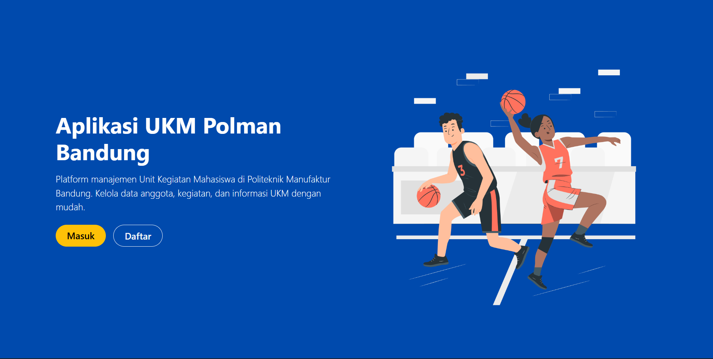
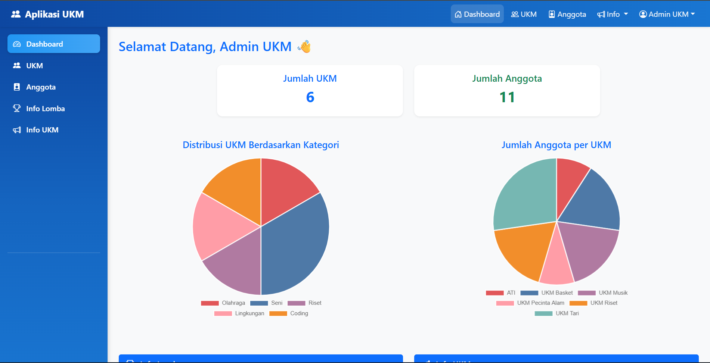
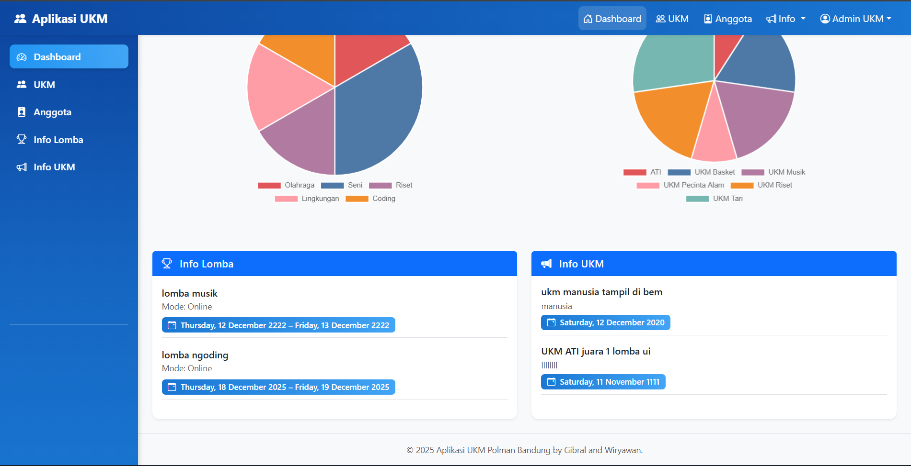

<p align="center">
  <a href="https://laravel.com" target="_blank">
    
  </a>
</p>

<p align="center">
  <a href="https://github.com/laravel/framework/actions"></a>
  <a href="https://packagist.org/packages/laravel/framework"></a>
  <a href="https://packagist.org/packages/laravel/framework"></a>
  <a href="https://packagist.org/packages/laravel/framework"></a>
</p>

# 🎓 UKM-App – Aplikasi Data Anggota UKM


> Aplikasi berbasis **Laravel 12.33** untuk mengelola data UKM, anggota, dan informasi kegiatan di **Politeknik Manufaktur Bandung**.  
> Dikembangkan sebagai proyek praktik mata kuliah *Pemrograman Web Framework (Laravel)*.

---

## 👥 Anggota Tim

1. **Gibral Haikal Faiz** – Fullstack Developer  
2. **Wiryawan** – Fullstack Developer

---

## 💡 Tujuan Proyek

Aplikasi ini dibuat untuk:
- Membantu pengurus UKM dalam mengelola data.  
- Mengatur data UKM dan anggotanya.  
- Menyebarkan informasi kegiatan & pengumuman.  
- Meningkatkan efisiensi administrasi UKM secara digital.

---

## ✨ Preview Aplikasi

Tampilan antarmuka yang sederhana dan responsif menggunakan **Bootstrap 5**.

<p align="center">
  
  <br>
  <em>Dashboard utama UKM-App</em>
</p>

<p align="center">
  
  
  
  <br>
  <em>Halaman Login dan Dashboard UKM</em>
</p>

---

## 🧩 Fitur Utama

- 🔐 Autentikasi (Login, Register, Logout)  
- 🏫 CRUD Data UKM  
- 👥 CRUD Data Anggota UKM  
- 🔍 Pencarian dan Filter Data  
- 📊 Dashboard dengan Statistik  
- 📱 Desain Responsif & Clean menggunakan Bootstrap 5  

---

## 🛠️ Teknologi yang Digunakan

| Komponen | Teknologi |
|-----------|------------|
| Framework Backend | **Laravel 12.33** |
| Frontend | **Blade Template + Bootstrap 5.3** |
| Database | **MySQL** |
| Bahasa Pemrograman | **PHP 8.2+** |
| Dependency Manager | **Composer** |
| Package Manager (opsional) | **NPM** |

---

## ⚙️ Instalasi & Menjalankan Proyek

1. **Clone Repository**
   ```bash
   git clone https://github.com/username/ukm-app.git
   cd ukm-app

2. **Install Dependencies**
   ```bash
   composer install
   npm install && npm run dev

3. **Konfigurasi Environment**
   ```bash
   cp .env.example .env
   php artisan key:generate

4. **Migrate Database**
   ```bash
   php artisan migrate

5. **Jalankan Server**
   ```bash
   php artisan serve
   
Lalu buka di browser: 👉 http://localhost:8000

---

📂 Struktur Folder Utama
```bash
ukm-app/
├── app/
│   ├── Http/Controllers/     # Logic dan kontrol alur data
│   ├── Models/               # Model Eloquent dan relasi
│
├── database/migrations/      # Skema database
│
├── resources/views/          # File tampilan Blade
│
├── routes/web.php            # Routing aplikasi
│
└── public/
    ├── css/                  # File CSS (Bootstrap, custom)
    ├── js/                   # File JavaScript
    └── screenshots/          # Gambar dokumentasi (dashboard.png, login.png, dll)
